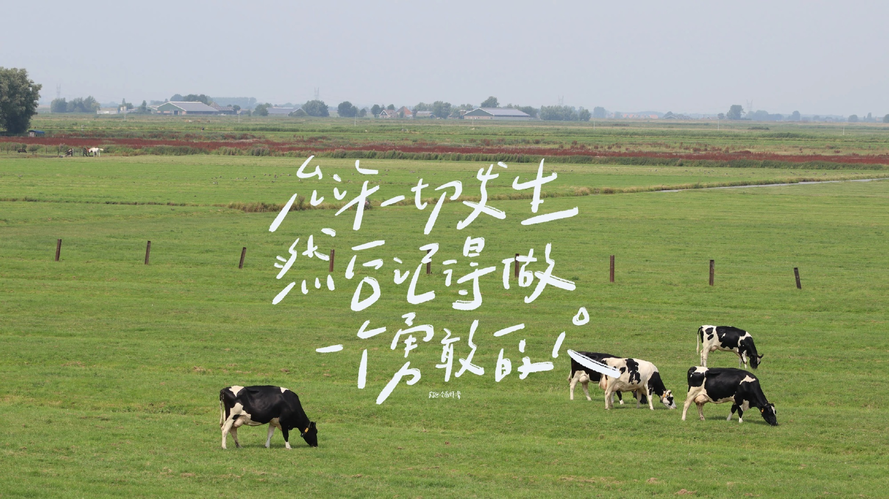

> 近来，常在窗边看树。  
> 看它沉默地立在风里，看光影在叶隙间游移，心中便有些模糊的念头，像未成形的晨雾 🌫，渐渐聚拢。

---

## ⬇️ 向下的决心

我想，生命或许该有某种**向下的决心**。  
不是沉沦，而是像一颗执拗的种籽 🌱，偏要选择最贫瘠的裂隙，把骨节楔入冷硬的岩层 ⛰️ 深处。那里没有和风暖阳，只有黑暗的挤压，雷声的余震 ⚡ 在体内结晶。

它默默吞咽着这一切，不为即刻的参天，只为在无人知晓的幽暗里，用每一次无声的撞击，将散落的星光 ✨ 煅烧、淬炼，锻成支撑日后舒展的、隐秘的钢 🔩。  
那是一种深沉的汲取，一种在寂静熔炉中的自我塑造。

---

## 🍃 摊开手掌般的绿意

当根基足够深沉，内在的脉络足够强韧，它便会在某个不经意的时刻——在喧嚣的路口，或者寂静的转角——**摊开手掌般的绿意**。

它站成一片荫凉 🌿，不为炫耀，只为承接。  
叶脉如蜿蜒的河床，静静等待着那些偶然坠落的“晨露” 💧：

- 旅人肩头抖落的尘霜  
- 某个午后眼角未干的咸涩  
- 笑声里未融尽的冰碴 ❄️  
- 叹息中沉浮的、细碎的星光 ✨  

每一片叶子，都像一只沉默的陶罐 🫙，微微倾斜着口，盛放这些来自人间的、带着体温的絮语。风过时，只带走叶片的轻颤和暖意 🌬️；而那些沉淀下来的重量，则在叶底悄悄凝结，包裹着微弱却不肯熄灭的火种 🕯️，如同深藏的琥珀。

---

## 🪨 沉默的核

岁月流转，枝头渐沉。  
那不是累累的甜蜜果实 🍎，而是一颗颗**沉默的核** 🪨。外壳坚硬，刻着风雨的纹路 🌀，是无名的印章；内核却柔软，蕴藏着破晓前最纯净的微光 🌅。

终于，它要松开紧握的枝桠，让那些凝聚了晨昏、烟火与低语的核，乘上信风 🌬️ 宽阔的脊背，像一群沉默的候鸟 🕊️，飞向远方未知的、或许荒芜的岸 🌾，去那里寻找属于它们的土壤。

---

## 🧗 向上的跋涉

而它自己呢？  
在某个注定的时刻，目光会投向那永恒的、沉默的白色峰峦 🏔️。它感到一种来自地心深处的、纯粹的引力 🧲。于是，它选择带着最深处年轮里镌刻的那颗核心的核 💎——那凝聚了所有承接与沉淀的精神印记——开始一场孤独而漫长的**向上跋涉**。

沿着无形的垂线，刺破稀薄得令人窒息的蓝 💠，直至抵达雪线之上 ❄️。在那里，在冰晶无声加冕的寂静王国 👑 里，在呼啸的、仿佛能洞穿灵魂的风声 🌪️ 中，它将这份来自低处、来自人间烟火的沉重与温热，以一种最庄重的方式，安放。

风，这位古老的诵经者 📜，会一遍遍诵读；而每一片飘落的雪 ❄️，都将是这无名史诗里一个洁白的句点 ⸰，印着最朴素的荣光。

---

## ✨ 尾声

我望着窗外的树 🌲，想着它向下扎根的黑暗，承接露水的温柔，果实离枝的决绝，以及指向雪峰的孤线。

生命的形式各异，但或许，总有些存在，注定要经历**深潜、盛放、馈赠**，最终归于一种**寂静的崇高** 🌌。  
它们的存在本身，就是一种低语，诉说着关于汲取、承接、远行与铭刻的故事。

窗外的树影婆娑，我的思绪也如叶影般摇曳 🍂。  
关于一棵树的漫想，也仅止于此了。