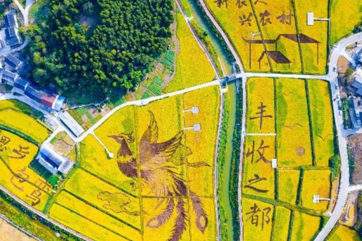
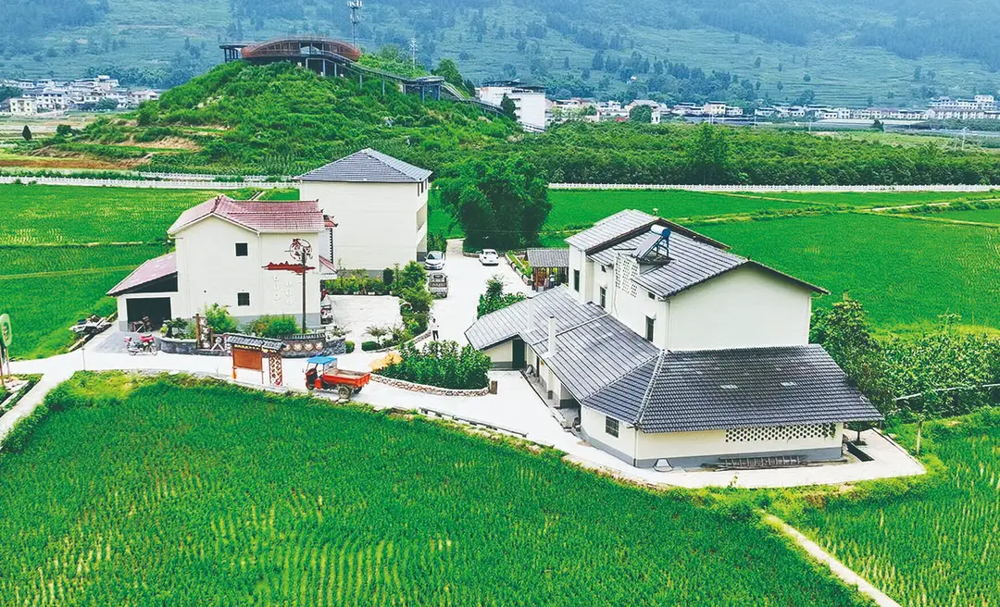

## **以包鸾镇为例：探索“三产融合”与基层治理协同推进的乡村振兴新路径**

**摘要**：实施乡村振兴战略是党的十九大作出的重大决策部署，是新时代“三农”工作的总抓手。本文以重庆市丰都县包鸾镇为研究案例，通过实地调研与访谈，深入剖析其通过推动一二三产业深度融合（“三产融合”）与创新基层治理模式，实现乡村全面振兴的实践路径。论文首先阐述了包鸾镇在特色民宿（飞鸾稻香居）、研学基地（凤鸾园）、特色产品（丰收馆）等方面的产业融合创新；其次，探讨了以“鸾妈妈”党群服务中心和村规民约为代表的基层治理与服务体系如何为乡村振兴提供内生动力与秩序保障；再次，分析了其在历史文化保护（人民桥）与生态建设方面的举措对涵养乡风文明的重要性。最后，本文亦客观指出了包鸾镇在发展过程中面临的资金、土地流转及村民意愿等挑战，并提出了相应的对策思考。包鸾镇的实践表明，乡村振兴必须坚持系统观念，将产业发展与治理效能提升相结合，方能实现农业强、农村美、农民富的宏伟目标。

 **关键词**：乡村振兴；三产融合；基层治理；包鸾镇；案例分析

---

### **一、引言：乡村振兴的战略意义与包鸾镇的实践价值**

“民族要复兴，乡村必振兴。”在全面建设社会主义现代化国家的新征程上，最艰巨最繁重的任务依然在农村。乡村振兴战略涵盖了产业、人才、文化、生态、组织五大方面的全面振兴，其核心在于破解城乡发展不平衡、农村发展不充分的矛盾，构建新型工农城乡关系。当前，全国各地都在因地制宜地探索乡村振兴的有效路径，而重庆丰都县包鸾镇的实践，为我们提供了一个观察乡村振兴战略在基层生动实践的宝贵样本。

包鸾镇并非资源禀赋异常突出的明星乡镇，其探索过程具有极强的普遍性和参考价值。它没有选择大拆大建或盲目引进工业项目，而是立足于自身原有的农业基础、生态本底和文化遗存，通过创新发展模式、激活内生动力，逐步走出一条以“三产融合”为引擎、以基层治理创新为保障、以文化生态传承为底蕴的特色发展之路。2025年8月23日，本调研小队对包鸾镇进行了实地考察，与镇政府工作人员刘杭同志进行了深入访谈，先后走访了政府服务中心、多个产业项目及文化场所，获得了大量一手资料。本文旨在系统梳理包鸾镇的实践经验，并从中提炼出对广大地区实施乡村振兴战略具有启示意义的政策建议。

### **二、 “三产融合”：构建现代乡村产业体系的核心引擎**

产业兴旺是解决农村一切问题的前提。包鸾镇紧紧抓住“融合”这个关键，打破一二三产业的界限，让农业从单一的生产功能向生态、休闲、教育、文化等多功能拓展，成功实现了产业的增值增效。

**（一） 农业为本：科技赋能与基础升级**  
产业融合的前提是稳固的第一产业。在包鸾镇的蓝莓温室大棚和凤鸾园（原火龙果基地），我们观察到了现代农业的雏形——**半自动化种植**。虽然因资金限制未能实现全自动化，但喷灌、温控等环节已由机械完成，人力主要集中于精细化的种植与采摘环节。这种模式既提高了生产效率，降低了劳动强度，又保留了一定的就业容量，为当地村民提供了“家门口”的就业岗位。这种务实的技术升级路径，对于资金并不充裕的广大乡村地区具有显著的借鉴意义：不追求一步到位的“高大上”，而是采用渐进式、实用性的技术改造，同样能有效夯实农业基础。

**（二） “农业+旅游”：打造沉浸式体验经济**  
包鸾镇深度挖掘农业的旅游价值，打造了多个特色项目。

1. **飞鸾稻香居**：由废弃老宅院改造而成的民宿，是“变废为宝”的典范。它不仅在建筑风格上与周边的稻田景观完美融合，营造出“稻花香里说丰年”的诗意栖居环境，更在其经营模式中嵌入了**利益联结机制**：优先雇佣本村劳动力，并与石里红枫景区合作流转村民土地山林，使村民能同时获得租金、薪金，共享发展红利。其举办的季节性活动（如摸鱼、打保龄球）更是将农业生产过程转化为有趣的旅游体验，增强了吸引力。
    
2. **思源民居宿**：该项目展示了另一种成功逻辑。其客源并非完全依赖传统的避暑概念，而是通过**极致的环境营造**（优异的绿化与清洁）、**便利的交通区位**（临近多个避暑胜地）和**高品质的设施**（别墅级公寓）来吸引游客。其独具特色的“化学元素”命名方式（如锌、锶），源于投资人的个人情怀，无形中塑造了独特的社区文化IP，增加了话题性和记忆点。
    

**（三） “农业+教育文化”：拓展产业价值新维度**  
包鸾镇将农业与文化、教育相结合，实现了价值的深度挖掘。

1. **凤鸾园研学基地**：这是“新农人+村集体+农户”利益联结机制的典型运营成果。它已超越单纯的种植园，转型为一个综合性的研学平台。园区内设置了生态大棚实验区、美食长廊、音乐草坪、农耕文化体验区和非遗传承教学区。 particularly，孩子们可以在这里学习**市级非遗技艺——包鸾竹席编织**，这使得传统的农业空间转变为了文化传承的课堂，实现了经济效益与文化效益的双赢。
    
2. **丰收馆与特色产品**：丰收馆作为一个集中展示窗口，不仅陈列着丰都肉牛、包鸾榨菜等传统特产，更推出了基于本地资源深度开发的“**南天思泉**”锶元素矿泉水以及“硒锶豆”等健康概念产品。这标志着包鸾镇的农业正从“卖原材料”向“卖产品”“卖品牌”“卖健康”升级，是基于生态价值实现的高层次产业融合。
    
3. **稻田艺术（凤凰台）**：利用不同颜色的稻谷“绘制”出巨大的凤凰图案，是创意农业的直观体现。这种大地艺术不仅成为了吸引游客的壮观景点，更成为了宣传包鸾镇形象的一张靓丽名片，极大地提升了地区的知名度和美誉度。
    

### **三、 治理有效：夯实乡村振兴的基层基础**

乡村振兴，治理有效是基础。包鸾镇的实践表明，高效的基层治理能够有效凝聚人心、化解矛盾、激发主体活力，为产业发展提供稳定的社会环境和秩序保障。

**（一） 党建引领与政务服务优化**  
在包鸾镇人民政府和各村党群服务中心，我们看到了一个**公开、透明、高效**的基层政府形象。政务公开栏、群众意见反馈箱、工作人员认真接待每一位村民的场景，体现了“服务型政府”的理念落地生根。政府对绿化建设的高度重视，更是其对“生态宜居”这一振兴要求的具体践行。这种良好的政风，是赢得群众信任、顺利推行各项政策的前提。

**（二） “鸾妈妈”模式：破解乡村民生难题的创新实践**  
“鸾妈妈”青少年家庭教育互助会是包鸾镇基层治理创新中最具温情的篇章。它精准击中了两个痛点：一是农村留守儿童课后看护和教育的“四点半难题”；二是外出务工家长的后顾之忧。  
其成功运作依赖于一个精巧的体系：

1. **党建引领**：互助会设立党支部，确保了活动的组织性和公益性方向。
    
2. **精准服务**：建立“周内+假期”、“课程+活动”的特色体系。周内提供作业辅导，假期开展丰富多彩的兴趣课程和本土文化活动（如重走红军路）。
    
3. **社区参与**：98名志愿者构成了服务主体，他们来自党校、高校、政府及社会爱心人士，形成了强大的志愿力量。
    
4. **可持续运营**：其资金主要来源于**村民年度捐款（约十几万元）**，这种“取之于民，用之于民”的模式，不仅解决了经费问题，更深层次地增强了社区的凝聚力和自我供血能力，使其摆脱了对上级资金的完全依赖，具备了强大的内生性和可持续性。
    

**（三） 村规民约与文化治理：重塑乡村精神文明**  
在包鸾村党群服务中心，墙上的村训——“珍惜村誉、互帮互助、敬老爱幼、知恩图报、克勤克俭、耕读传家”——24个字凝练了该村的价值观和行为准则，是新时代乡风文明的具体化。更值得一提的是，当地政府针对“滥办酒席”这一陈规陋习，没有采取简单的禁止手段，而是通过**创新性地集中举办大学生升学庆典**来进行疏导。这种方式既满足了村民分享喜悦、获得尊重的心理需求，又杜绝了铺张浪费和攀比之风，有效提升了村集体的凝聚力，是文化治理的高明之举。将全村居民名字刻墙展示，更是强化了村民的集体归属感和荣誉感。

### **四、 文化传承与生态保护：铸就乡村振兴的深厚底蕴**

乡村振兴既要“塑形”，更要“铸魂”。文化和生态是乡村的固有基因，是区别于城市的独特魅力所在。

**（一） 历史文脉的守护与活化**  
**人民桥（人民运动桥）** 作为一座拥有七十多年历史的市级文物保护单位，不仅是遮阳避雨、休憩交流的物理空间，更是包鸾镇历史记忆和文化传承的**重要象征**。其对这座木质廊桥的成功保护和持续利用，让静态的历史建筑变成了活化的文化场所，使后代能够直观地了解家乡的历史，增强了文化自信和认同感。

**（二） 生态宜居的环境打造**  
纵观整个包鸾镇，从思源民宿的优美环境，到政府大力推崇的绿化建设，再到稻田艺术的生态景观，无不体现出对生态环境的高度重视。“绿水青山就是金山银山”的理念在这里得到了实践。整洁的村容、良好的生态，本身就是一种发展资源，是吸引人才、资本和游客的核心竞争力之一。

### **五、 面临的挑战与未来发展的对策思考**

尽管成绩显著，但包鸾镇的乡村振兴之路并非一片坦途。我们的调研也揭示了其面临的一些挑战，这些挑战在我国乡村地区具有普遍性。

**（一） 主要挑战**

1. **资金短缺**：这是制约发展的硬约束。如蓝莓大棚无法升级全自动化、旅游配套设施（如公交线路）推进缓慢等问题，其根源都在于资金不足。
    
2. **村民意愿与土地流转难题**：部分村民不愿出让土地，影响了项目的统一规划和规模化实施。这背后涉及对传统生产方式的留恋、对补偿标准的疑虑以及对未来生活保障的担忧等复杂心理。
    
3. **产业发展韧性有待加强**：当前产业多依赖于旅游体验，抗风险能力（如疫情等突发公共事件）相对较弱，需要进一步拓展产业链条，构建更加多元化的产业支撑体系。
    

**（二） 对策建议**

1. **创新投融资机制**：积极争取国家、省市各级的乡村振兴专项扶持资金和项目；探索推广PPP（政府与社会资本合作）模式，引入更多社会资本；鼓励金融机构开发更适合乡村产业的信贷产品。
    
2. **完善利益联结机制，深化产权改革**：进一步推广“新农人+村集体+农户”、“保底收益+按股分红”等模式，让农民更多分享产业增值收益。同时，要深化农村“三变”改革（资源变资产、资金变股金、农民变股东），清晰产权，保障农民权益，通过耐心细致的工作和可见的收益示范，逐步化解土地流转难题。
    
3. **推动数字赋能与品牌建设**：大力发展电商，将“南天思泉”、“包鸾竹编”等特色产品通过互联网销往全国；运用数字技术提升旅游服务的智能化和便捷度。同时，集中力量打造“硒锶健康”、“包鸾非遗”等区域性公共品牌，提升整体竞争力。
    
4. **促进人才回流与培养**：制定优惠政策，吸引大学生、外出务工能手等返乡创业就业，成为“新农人”。加强对本地农民的技能培训，使其更快适应现代农业和旅游业发展的需要。
    

### **六、 结论**

包鸾镇的乡村振兴实践，是一幅由“三产融合”的产业蓝图、“治理有效”的秩序基石以及“文化生态”的深厚底蕴共同绘就的生动画卷。它告诉我们，乡村振兴没有一成不变的模式，关键在于立足本土资源，勇于创新，充分调动政府、市场与农民三方面的积极性。包鸾镇通过飞鸾稻香居、凤鸾园等实现了产业的创造性转化，通过“鸾妈妈”互助会和村规民约实现了治理的创新性发展，通过对人民桥、竹编技艺的保护实现了文化的传承性弘扬。

其发展历程印证了**系统思维**的重要性：产业发展为治理创新和文化繁荣提供了物质基础，而有效的治理和文化的繁荣又反过来为产业的持续发展创造了稳定的社会环境和独特的人文吸引力。尽管挑战依然存在，但包鸾镇所探索出的这条融合发展与治理协同并进的路径，为其未来的高质量发展奠定了坚实基础，也为我国广大正处于探索阶段的乡村地区提供了极具价值的参考范式。未来的包鸾镇，若能有效破解资金与土地瓶颈，进一步深化数字赋能和品牌建设，必将在乡村振兴的广阔天地中焕发出更加蓬勃的生机与活力。

---

**参考文献** 
[1] 习近平. 决胜全面建成小康社会 夺取新时代中国特色社会主义伟大胜利——在中国共产党第十九次全国代表大会上的报告[R]. 北京: 人民出版社, 2017.  
[2] 《中共中央 国务院关于实施乡村振兴战略的意见》. 2018.  
[3] 陈锡文. 实施乡村振兴战略，推进农业农村现代化[J]. 中国农村经济, 2018(1).  
[4] 丰都县包鸾镇政府. 包鸾镇乡村振兴规划（2021-2025）[Z]. 2021.