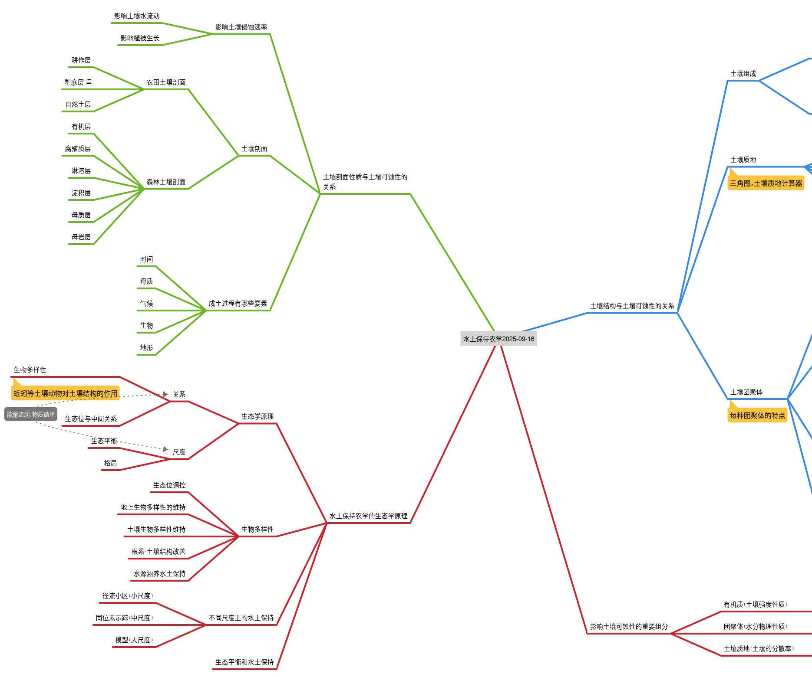

> 为什么有些土地肥沃富饶，有些却贫瘠不堪？秘密就在土壤的结构里

> 当我们漫步在田野间，可能很少会注意到脚下的土壤。但这些看似普通的泥土，其实有着精密的内部结构，正是这种结构决定了土壤是否健康，能否抵抗风雨侵蚀。

## 土壤的"骨架"与"血肉"

土壤就像是一个精密的生态系统，由固体颗粒和孔隙空间组成。

**矿物质**是土壤的"骨架"，占土壤固体部分的95%以上。它们来自岩石的风化，就像建筑的砖石，支撑着整个土壤体系。

**有机质**则是土壤的"血肉"，来自动植物残体和微生物代谢产物。有趣的是，虽然我国整体土壤有机质在增加，但东北黑土区的有机质却在下降，这提醒我们需要更加关注土壤健康。

> 📊 实例：黄土高原通过退耕还林，土壤有机质从0.5%提升到1.2%，大大增强了土壤的抗侵蚀能力

**土壤生物**是看不见的英雄：蚯蚓能创造生物孔隙，提高土壤入渗率30-50%；微生物则像小小的建筑师，不断改善着土壤结构。

## 土壤质地：粗细之间的平衡

土壤质地指的是土壤颗粒的粗细程度，通常分为：

- **石砾**（>2mm）：影响土壤通透性
    
- **沙粒**：通透性好但保水保肥差
    
- **粉粒**：最容易受到侵蚀
    
- **黏粒**：具有胶结作用，能增强土壤稳定性
    

理想的是**壤土**——各种颗粒比例适中，既透气又保水，就像制作蛋糕的面粉，不能太粗也不能太细。

## 土壤团聚体：大自然的建筑奇迹

土壤颗粒会团聚在一起形成各种结构，其中**团粒结构**是最理想的状态。好的团粒结构需要：

1. 有适当的形状和大小
    
2. 具备多级孔隙（像海绵一样）
    
3. 有一定的稳定性
    

形成这种结构需要两个过程：一是**粘结团聚**（靠有机质、微生物和矿物质粘合），二是**切割造型**（靠根系、耕作和自然力量塑造）。

## 土壤剖面：大地的年轮

如果我们向下挖掘，会发现土壤是分层的：

**农田土壤**通常分为：

- 耕作层（最肥沃）
    
- 犁底层（比较紧实，需要深耕来打破）
    
- 自然土层
    

**森林土壤**的层次更丰富，从有机层到母岩层，记录着自然演替的历史。

## 生态智慧：模仿自然的水土保持

大自然是最佳的老师。良好的水土保持实践都在模仿自然：

- **保持生物多样性**：不同作物间作，就像自然群落一样相互支持
    
- **保护土壤生物**：蚯蚓、微生物都是我们的盟友
    
- **因地制宜**：根据当地气候、地形采用合适的方法
    

> 🌳 案例：三峡库区采用复合农林模式后，土壤侵蚀量减少了60%以上

## 实践出真知：三个改良土壤的关键

1. **增加有机质**：就像给土壤补充营养，施用有机肥可提高团聚体稳定性25-40%
    
2. **促进团聚体形成**：采用保护性耕作，让＞0.25mm的团聚体增加30%
    
3. **改善土壤质地**：通过添加黏土改良砂质土壤，可使侵蚀量降低50%以上
    

## 结语：每个人都可以是土壤守护者

保护土壤不需要高深的技术，从身边小事做起：

- 支持生态农业产品
    
- 参与植树造林活动
    
- 在自己的花园中采用有机种植
    
- 传播土壤保护的重要性
    

健康的土壤是生命的基础。让我们共同努力，守护这珍贵的资源，为子孙后代留下肥沃的土地。