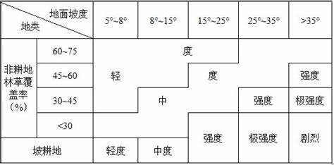
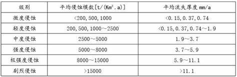

## 引言：为什么关注土壤侵蚀？

土壤是地球表面珍贵的脆弱层，孕育了人类文明。然而，在全球范围内，土壤正以惊人的速度流失。据联合国粮农组织估计，全球每年因土壤侵蚀损失的耕地高达1000万公顷。了解土壤侵蚀的类型、形式和强度，对于制定有效防治策略至关重要。

## 一、土壤侵蚀的三大分类维度

### 1. 按外营力种类划分

土壤侵蚀可以根据引发侵蚀的外部营力类型进行分类，主要包括：水力、风力、重力、冻融作用、化学溶解和生物活动等。不同营力作用形成的侵蚀地貌和防治措施也各不相同。

### 2. 按发生速率划分

- **正常侵蚀**：也称为自然侵蚀，是在自然植被和地质条件下发生的、速率较为缓慢的侵蚀过程，通常与土壤自然形成速率相平衡，维持着生态系统的相对稳定。
    
- **加速侵蚀**：由于人类不合理活动（如森林砍伐、过度放牧、不合理的农业耕作等）而引发的，速率显著高于自然背景的侵蚀过程，是当前水土流失的主要根源。
    

### 3. 按发生时间划分

- **古代侵蚀**：发生在历史时期或更早地质时代的侵蚀过程，形成了今天我们看到的大量侵蚀地貌。
    
- **现代侵蚀**：当前正在发生的侵蚀过程，通常受自然因素与人为活动的共同影响，是水土保持工作的主要对象。
    

## 二、土壤侵蚀的多样形式

### 水力侵蚀：最常见侵蚀类型

水力侵蚀是由水流作用引起的土壤流失现象，是最主要和最常见的侵蚀类型：

**溅蚀**：雨滴击溅土壤表面，使土壤颗粒分离和溅起，是侵蚀过程的第一个阶段

**面蚀**：地表较为均匀的土壤流失，根据表现形式分为：

- 细沟状面蚀：由分散水流初步集中形成细小沟纹（可通过耕作措施消除）
    
- 层状面蚀：表层土壤较为均匀地流失
    
- 沙砾化面蚀：表层细土被冲蚀，残留沙砾覆盖地表
    
- 鳞片状面蚀：地表呈片状或不连续剥蚀现象
    

**沟蚀**：水流集中冲刷形成明显沟道，按发育阶段分为：

- 浅沟：沟深较浅，可通过常规耕作修复
    
- 切沟：沟道较深，耕作难以恢复
    
- 冲沟：沟道发育明显，具有较为固定的形态
    
- 河沟：沟道进一步扩展，趋于稳定
    

**特殊类型**：

- 山洪侵蚀：突发性洪水引起的强烈冲刷和剥蚀
    
- 海岸及库岸侵蚀：水体波浪和流水对岸坡的冲刷和侵蚀
    

> **知识拓展**：为什么细沟状面蚀归为面蚀而不是沟蚀？  
> 细沟状面蚀虽然形成了细小沟纹，但其成因以层状水流为主，伴有初步集中水流，形成的沟纹浅且可通过农业耕种措施（如犁地、平整）消除，尚未发展成稳定的沟道系统，因此不属于沟蚀范畴。

### 其他侵蚀类型

**风力侵蚀**：在干旱半干旱地区，风力作用下土壤颗粒的搬运和沉积过程

**重力侵蚀**：如山体滑坡、崩塌、泥石流等因重力作用导致的土体移动

**混合侵蚀**：两种及以上侵蚀力共同作用，如水力和重力复合侵蚀

**冻融侵蚀**：因土壤中水分反复冻结和融化导致的土体松动和移动

**冰川侵蚀**：冰川运动过程中对地表物质的刨蚀和搬运

**化学侵蚀**：

- 淋溶侵蚀：可溶性盐分和养分被水流溶解带走，导致土地退化
    
- 岩溶侵蚀（喀斯特侵蚀）：可溶性岩石（如石灰岩）被水溶解形成的特殊地貌过程
    

**植物侵蚀（生物侵蚀）**：植物根系生长、动物挖掘等活动对土壤结构的破坏

## 三、如何评估土壤侵蚀？程度与强度指标

### 土壤侵蚀量（定量描述）

**土壤侵蚀模数**：指单位时间单位面积上的土壤流失量，通常单位为 t/(km²·a)，是衡量土壤侵蚀强度的核心指标

### 土壤侵蚀程度（定性描述）

用于描述某一区域土壤侵蚀的整体状况，如轻度、中度、强度、极强度等，通常通过野外调查和遥感解译相结合的方法确定

### 容许土壤流失量

指在维持土地生产力可持续的前提下，每年允许的最大土壤流失量。不同地区的容许值有所差异：

- 西北黄土高原区：1000 t/(km²·a)
    
- 东北黑土区：200 t/(km²·a)
    
- 北方土石山区：200 t/(km²·a)
    
- 南方红壤丘陵区：500 t/(km²·a)
    
- 西南土石山区：500 t/(km²·a)
    

## 四、水土保持方案编制：法规与技术依据

编制科学合理的水土保持方案需要参考多方面的文件和规范：

### 水土保持法律法规体系

- **法律**：《中华人民共和国水土保持法》是根本大法
    
- **法规**：国务院及地方政府颁布的水土保持条例和实施办法
    
- **规章**：水利部等部委发布的有关水土保持管理的部门规章
    
- **规范性文件**：各级政府部门发布的水土保持相关通知、指导意见等
    

> **制定原则**：自上而下制定法规遵循两项基本原则
> 
> 1. 下级法规不能与上级法规相抵触
>     
> 2. 法规与规章是对《水土保持法》的具体化和实施性规定
>     

### 技术标准规范体系

包括国家标准（GB）、行业标准（如SL水利行业标准）等，如：

- 《土壤侵蚀分类分级标准》（SL 190）
    
- 《生产建设项目水土保持技术标准》（GB 50433）
    

> **标准vs规范vs规程**：
> 
> - **标准**：一般是强制性或推荐性的技术要求
>     
> - **规范**：多指工程设计、施工和管理中的技术规定
>     
> - **规程**：侧重于操作程序、作业方法的规定
>     

### 其他依据

相关规划文件、环境影响评价要求、地方生态保护政策等也是方案编制的重要参考

## 五、面蚀分级与水力侵蚀强度指标

### 面蚀分级指标

根据地表植被覆盖度、坡度和侵蚀沟发育情况等因素划分：

- **微度**：植被覆盖高，无明显面蚀
    
- **轻度**：表土略有流失，植被覆盖较好
    
- **中度**：表土明显流失，出现细沟或鳞片状侵蚀
    
- **强度**：表土大量流失，细沟密集，局部出现浅沟
    
- **剧烈**：面蚀加剧，土地退化明显，农业利用受限
    

### 水力侵蚀强度分级

参考《土壤侵蚀分类分级标准》（SL 190），按侵蚀模数分为微度、轻度、中度、强烈、极强烈和剧烈等等级，具体阈值因地区而异。

## 结语：防治土壤侵蚀，人人有责

土壤侵蚀是一个渐进的过程，往往在人们察觉之前就已经造成了不可逆转的损害。了解土壤侵蚀的基本类型和形式，认识其严重性和评估方法，是采取有效防治措施的基础。从政府部门的规划管理到每个人的日常行为，都能为水土保持贡献力量。

保护土壤，就是保护我们共同的未来。