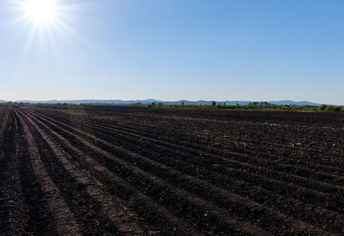

> 水土流失，被称为“土地的癌症”，是一个悄无声息却影响深远的全球性环境问题。作为世界上受此问题困扰最严重的国家之一，中国的防治之路任重道远。本文将带您深入理解中国水土流失的全貌。

## 一、严峻现状：分布广、强度高、危害重

中国的水土流失呈现出**分布范围极广、侵蚀类型多样、时空高度集中、流失总量巨大**的显著特点。每年数十亿吨的表土流失，带走的不仅是土壤，更是土地的肥力、农民的希望和生态系统的健康。其直接后果是**耕地减少、土地石漠化沙化、水库江河淤积、水旱灾害加剧**，严重恶化人民群众的生产生活条件。

## 二、追根溯源：侵蚀因子的科学度量

要治理，先得科学评估。**通用土壤流失方程（USLE）** 为我们提供了一个强大的工具。它将复杂的侵蚀过程拆解为六个因子：**降雨（R）**、**土壤本身（K）**、**地形（L&S）** 是自然背景，而**植被（C）** 和**水保措施（P）** 则是人类可以干预的关键。在野外，我们则常用**三因子快速判断法**，通过简单地看一块地是**耕地还是非耕地**，再测量其**坡度**和**植被覆盖度**，就能快速判断出其侵蚀强度等级，高效且实用。

## 三、地域差异：八大侵蚀区的独特挑战

中国地域广阔，水土流失也“因地而异”，主要可划分为八大区域，各有各的“心病”：

- **东北黑土区**： 世界级的肥沃黑土正因“漫岗长坡”的地形和机械化耕作而面临肥力枯竭的危机。
    
- **西北黄土高原区**： 这里是世界上水力侵蚀最强烈的地区，千沟万壑的地貌是其见证。
    
- **南方红壤区**： 降水充沛，加之剧烈的人为开发，导致剧烈的面蚀和独特的“崩岗”侵蚀。
    
- **西南岩溶区**： 石漠化是最大威胁，侵蚀不仅发生在地表，更隐秘而严重地发生在地下河系中。
    
- **北方风沙区**： 风力侵蚀是主角，沙漠化、沙尘暴是其主要表现。
    
- **青藏高原区**： 高寒环境下的冻融侵蚀是特色，生态系统极其脆弱。
    
- **北方土石山区** & **西南紫色土区**： 土层浅薄，母岩易风化，一旦植被破坏，恢复极其困难。
    

## 四、深层原因：不合理的人类活动是加速器

自然因素是基础，但**不合理的人类活动**才是加剧水土流失的催化剂。**陡坡开垦、滥伐森林、过度放牧**直接破坏了保护伞；而现代社会的**开矿、修路、城市建设**等生产建设活动，若不加以规范，其造成的扰动侵蚀程度甚至远超农业活动。

## 五、未来之路：从“治”到“防”的智慧转变

我们的水保工作正在发生深刻变革：

1. **强预防**： 通过法律法规和监管，从源头上管住生产建设项目，守住绿水青山。
    
2. **系统治**： 摒弃单一手段，统筹“山水林田湖草沙”生命共同体，进行综合治理。
    
3. **促修复**： 最大程度地依靠自然力量，通过封山禁牧、生态移民，给生态一个自我愈合的机会。
    
4. **靠科技**： 运用卫星遥感、无人机、大数据等“天-空-地”一体化信息技术，实现精准、动态的监测与预报。
    

**结语**  
水土保持是一场关乎国家生态安全和可持续发展的持久战。它不仅是政府的责任，更需要我们每一个人的参与。节约每一张纸，减少不必要的开发消费，关注身边的土地状况，都是在为保持水土贡献一份力量。守护脚下之土，方能永葆生机之源。