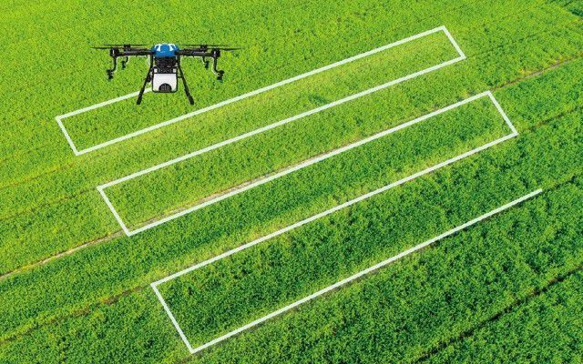

> 如果一粒种子知道它将被卫星凝视、被传感器拥抱、被算法呵护，它还会仅仅把自己当作一粒种子吗？

在中国东北的寒地黑土上，一台无人驾驶拖拉机正以厘米级精度播种；云南的钢架温室里，空气凤梨在传感器编织的“数据襁褓”中舒展叶片；而千里之外的实验室中，育种专家正用深度学习模型“预览”未来十年的作物性状。这不是科幻，而是多学科交叉的智慧农业正在书写的现实。

## 一、当作物科学遇见遥感科学：给地球装上传感器

### 1.1 传感器：农田的“神经末梢”

在智慧农业的版图上，传感器如同神经末梢般密布。它们不仅监测空气温湿度、光照强度、CO₂浓度这些“常规指标”，更在微观世界里大显身手——

- **SmartSoil芯片**：这枚嵌入土壤的“黑匣子”能同时解析温湿度、EC值（电导率）、pH值，甚至通过介电常数变化捕捉根系呼吸的微弱电信号
    
- **声学传感器**：通过分析叶片振动频率，可提前3天预警蚜虫侵袭（蚜虫刺吸式口器会改变叶片振动模态）
    
- **光谱传感器阵列**：在0.4-2.5μm波段内，以5nm间隔扫描作物反射光谱，其数据量相当于每天为每株水稻拍摄2700张“多光谱X光片”
    

> **GPRS**（General Packet Radio Service）在这里扮演着“农田信使”的角色——这些传感器通过GPRS模块将数据打包成“数字雨水”，经由蜂窝网络汇入云端。相较Wi-Fi，它的覆盖半径可达30公里，且能在-40℃的东北冻土中稳定工作。

### 1.2 遥感：农业的“天眼系统”

当传感器在微观世界深耕时，遥感技术正在宏观尺度上重构农业认知。以中国高分六号卫星为例，其携带的16米多光谱相机每天可扫描全球90%的耕地，单幅影像覆盖800公里×800公里区域，相当于把整个德国农田装进一张照片。

**植被指数**是遥感解码作物健康的“摩尔斯电码”：

- **NDVI**（归一化植被指数）= (近红外-红光)/(近红外+红光)，当NDVI>0.9时，水稻可能贪青徒长
    
- **EVI**（增强植被指数）通过蓝光波段校正大气影响，在叶面积指数（**LAI**，Leaf Area Index）>3时仍保持线性响应
    
- **红边植被指数**（Red-edge NDVI）能捕捉叶片叶绿素含量5%的细微变化，其精度相当于从太空识别出一片足球场中哪块草皮缺水
    

> 在黑龙江农垦总局的实验中，通过融合Sentinel-2卫星10米分辨率的NDVI时序数据与无人机5厘米分辨率的热红外影像，将水稻估产误差从传统方法的±15%压缩到±3%。

## 二、当系统科学遇见工程科学：在比特与原子之间搭桥

### 2.1 数据传输：5G还是LoRa？这是个问题

在广西的甘蔗地里，工程师们曾面临两难选择：5G基站每平方公里造价约50万元，而LoRa（Long Range）自组网每平方公里仅需8000元。最终他们采用“5G+LoRa”混合架构——

- **LoRa**：负责传感器数据“最后一公里”，其穿透力可穿透3层甘蔗叶，在-136dBm灵敏度下仍能接收信号
    
- **5G**：用于传输无人机4K巡检视频，其1ms超低时延使植保无人机能在检测到病虫害时0.3秒内启动精准喷洒
    

### 2.2 边缘计算：在农田里部署“迷你大脑”

在宁夏的枸杞基地，边缘计算节点（NVIDIA Jetson Xavier NX）被直接安装在灌溉阀门上。这个功耗仅20瓦的“迷你大脑”能实时处理：

- 多光谱相机每秒120MB的原始数据流
    
- 土壤墒情传感器每10秒更新的12维数据向量
    
- 气象雷达的降水概率预测模型
    

通过TensorRT优化的YOLOv4模型，它能在200毫秒内识别出枸杞叶片上的白粉病斑，并立即调节相邻喷头的嘧菌酯浓度（从常规的1000倍液调整为500倍液）。

## 三、当人工智能遇见农业：算法如何听懂作物的语言？

### 3.1 育种：从“经验育种”到“算法育种”

中国农科院作科所开发的**DeepSeed**模型，用3.2PB的作物基因组、表型组、环境组数据训练而成。它能预测：

- 在特定积温条件下，某个基因位点变异可使水稻千粒重增加0.8克
    
- 将某个抗旱基因导入小麦，在年降水量400mm地区可使产量提升19.7%，但蛋白质含量下降2.3%
    

2023年，该模型指导培育的“中麦578”节水品种，在河北邯郸试种时，仅用传统灌溉水量的58%就达到了亩产618公斤。

### 3.2 田间管理：数字孪生农田

在江苏常州的水稻数字孪生系统中，每蔸水稻都有独立的“数字分身”。系统通过：

- **物理引擎**：模拟叶片-茎秆-根系在风载下的力学响应
    
- **生理模型**：耦合Farquhar光合作用模型与Penman-Monteith蒸散发方程
    
- **强化学习**：让AI代理在虚拟农田中试错10万次，找到最佳的水肥调控策略
    

最终，这个数字孪生系统使氮肥利用率从35%提升到52%，相当于每亩减少尿素施用7.5公斤。

### 3.3 价格预测：用LSTM捕捉市场的“心跳”

郑州商品交易所的“农价通”系统，将全国286个批发市场的番茄价格、天气预报、抖音美食话题热度、甚至“高考期间食堂采购量”等128维数据输入LSTM网络。其预测结果显示：

- 当“淄博烧烤”抖音播放量单日增长500%时，两周后大葱批发价将上涨12-15%
    
- 在高考前第7天，土豆价格会出现3.2%的季节性微涨（食堂提前备货）
    

## 四、智慧农业的中国实践：从黑土地到玻璃温室

### 4.1 北大荒：无人农场的“春耕方程式”

在黑龙江七星农场，春耕被解构为一道算法题：

`最优播种时间 = f(土壤温度≥8℃持续3天, 未来5天无霜冻概率<10%, 土壤含水量在田间持水量65-75%)`

2024年春天，无人农机集群根据卫星云图和土壤墒情传感器数据，将10万亩水稻的播种窗口压缩到72小时内完成，出苗整齐度达到92%（传统方式约78%）。

### 4.2 寿光蔬菜：玻璃温室里的“气候编程”

山东寿光某智慧温室的番茄种植，实现了“气候的可编程化”：

- 在果实转色期，通过调节LED补光灯的660nm红光/450nm蓝光比例至7:3，可使番茄红素含量提升23%
    
- 当检测到叶片水势低于-1.2MPa时，系统自动启动微雾喷灌，每株番茄每日节水180ml
    

更精妙的是，通过计算机视觉识别番茄萼片角度（当角度>110°时表明成熟），采摘机器人可在凌晨3点启动工作，避开白天的高温蒸腾。

### 4.3 区块链溯源：给每个苹果写传记

在陕西洛川，每个苹果箱都贴有NFC标签。扫描后可见：

- 出生证明：来自延安市洛川县石头镇吴家庄村，海拔1102米
    
- 成长日记：4月12日疏花（保留中心花），5月3日套袋（双层纸袋），8月7日摘袋转色
    
- 体检报告：9月1日检测，糖度14.2°Brix，硬度7.8kg/cm²
    
- 旅行日志：9月10日3:20装车，冷链车温度2±0.5℃，9月12日10:45抵达上海浦东嘉里中心
    

这套由蚂蚁链开发的系统，使洛川苹果溢价率达到40%，复购率提升65%。

## 尾声：当农业成为科技的诗学

智慧农业不是简单的“机器换人”，而是一场认知革命——它让农业从“看天吃饭”的玄学，变成“算天而作”的科学。当东北的黑土地开始用卫星语言说话，当云南的玫瑰在算法谱写的光周期中绽放，我们突然意识到：农业最古老的命题“如何养育人类”，正在获得最现代的答案。

> 正如哲学家海德格尔所言：“技术的本质是解蔽。”智慧农业解蔽的，不仅是土地的潜力，更是人类与自然对话的新可能。下一次，当你咀嚼一颗智慧农场的水稻时，或许能尝到一点数字时代的星光。