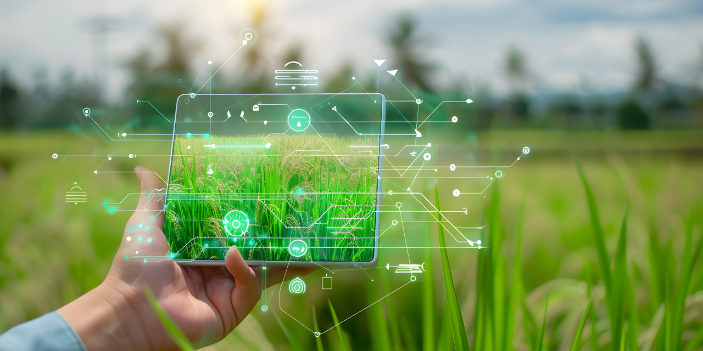
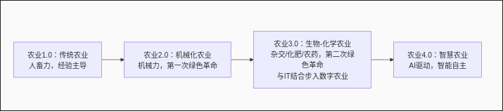

>农业，是人类文明的基石，也是最古老的生产行业。它根植于土地，依赖于自然，具有鲜明的**经验性**、**复杂性**、**不可控性**和**高强度性**。千百年来，农民们"看天吃饭"，依靠代代相传的经验进行耕作，应对着病虫害、气候变化等无数不确定因素。而今天，一场由人工智能（AI）引领的农业革命正在悄然发生，智慧农业正为我们勾勒出一幅全新的农耕图景。

## 一、AI如何破解农业的核心难题？

农业的痛点与AI的解决方案完美对应：

- **应对经验性 → AI科学决策**：传统农业依赖"老把式"的经验，而AI通过分析海量的气象、土壤、市场数据，可以提供精准的播种、施肥、灌溉和收获建议，将农业生产从"经验驱动"转变为**数据驱动**的科学决策。
    
- **应对复杂性 → AI多因素协同**：农业生产是土壤、水分、气候、品种、管理等多因素交织的复杂系统。AI算法能够协同分析这些因素，找到最优解，实现资源利用的最大化和产出的最优化。
    
- **应对不可控 → AI智能应对与控制**：面对干旱、洪涝、病虫害等不可控自然因素，AI驱动的监测系统（如卫星遥感、无人机巡田）可以**提前预警**，智能灌溉系统可以抗旱，autonomous sprayers（自主喷药机）可以精准施药，将损失降到最低。
    
- **应对高强度 → AI机器代替人力**：从自动驾驶拖拉机到智能采摘机器人，AI装备正逐步将人类从繁重、重复的体力劳动中解放出来，有效应对农村劳动力老龄化与短缺问题。

## 二、从传统到智慧：农业的演进之路

农业的发展并非一蹴而就，它经历了清晰的阶段演进：

- **传统农业（农业1.0）**：以人力、畜力为主，依赖世代积累的经验，生产效率低下。
    
- **机械化农业（农业2.0）**：以机械动力代替人畜力，实现了**第一次绿色革命**，大幅提升了生产效率。
    
- **生物-化学农业（农业3.0）**：以杂交育种、化肥、农药为代表，实现了**第二次绿色革命**。后期与信息技术结合，催生了**数字农业**，开始利用传感器、软件进行数据管理。
    
- **智慧农业（农业4.0）**：当前农业发展的最高阶段。核心是**数据的智能化应用**，通过AI、IoT、大数据、robotics等技术，让机器实现自主决策、自主作业，农业生产进入智能化时代。

> **中国正处于从3.0向4.0阶段过渡的关键时期**，正从"集约化"生产迈向"智慧化"管理。

## 三、关键技术应用：autonomous sprayers（自主喷药机）

在智慧农业的应用中，autonomous sprayers是极具代表性的智能装备。这是一种集成了感知、决策和执行系统的农业机器人，能够在无人操作的情况下自主完成农田喷药作业。

通过GPS、摄像头和AI算法，autonomous sprayers可以精准识别作物与杂草，实现"定点喷洒"而非传统的地毯式喷洒，减少了90%以上的化学药剂使用。同时，它实现了"人药分离"，保护了操作者健康，并可24小时不间断工作，大大提升了作业效率。这项技术正是AI智能应对与控制农业不可控因素的最佳体现。

## 四、绿色革命的演进：从产量到可持续

### 第一次绿色革命

发生在20世纪40-70年代的第一次绿色革命，以**诺曼·博洛格**为代表的科学家通过培育矮秆抗倒伏的高产小麦、水稻品种，配合化肥、农药和灌溉技术的大规模使用，使全球粮食产量实现了前所未有的增长，成功避免了大规模饥荒的发生。其核心是解决"吃得饱"的问题，但也带来了土壤退化、环境污染等生态问题。

### 第二次绿色革命

正在进行的第二次绿色革命则以**生物技术**和**信息技术**为双驱动。一方面通过基因工程、基因编辑等技术培育抗病虫、耐逆境、营养强化的新品种；另一方面利用物联网、AI、大数据等技术实现精准农业管理。其目标是不仅追求产量，更注重品质、资源效率和环境可持续性，解决"吃得好、更环保"的问题。

## 五、智慧农业的完整定义与核心要素

**智慧农业**绝非简单的机械化和信息化。它是基于现代农业三大生产要素深度融合的综合性农业形态：

具体而言，智慧农业是**以信息技术为支撑，以数据要素为驱动，通过智能装备与生产经营过程的深度融合，实现农业生产、管理、服务全过程的数字化、网络化、智能化的新型农业形态**。

其三大核心要素包括：

- **BT是基础**：生物技术提供优良的品种，是获得高产、优质农产品的遗传基础。
    
- **IT是赋能**：信息技术通过数据、算法和模型，为机器注入"灵魂"，使其具备"智慧"，实现科学决策。
    
- **IE是手段**：智能装备是最终落地执行的"躯干"，包括智能拖拉机、无人机、机器人等具体工具。
    

三者缺一不可，共同构成了智慧农业的生态体系，推动农业从传统经验型向现代智能型转变。

## 六、国家战略与未来方向

我国高度重视智慧农业的发展。国务院发布的 **《新一代人工智能发展规划》** 中明确指出，要发展**智能农业**，建立智慧农业智能化示范园区，推动人工智能在农业生产、经营、管理和服务等环节的深度应用。

这一国家战略正推动着农业实现 **"三个转变"**：

1. **电脑替代人脑**：用AI的分析决策能力替代传统的人脑经验判断。
    
2. **机器替代人工**：用智能装备替代人力，从事枯燥、繁重、重复性的劳动。
    
3. **自主技术替代进口**：突破关键核心技术，研发拥有自主知识产权的智能农业装备与系统，保障国家粮食安全。
    

## 七、结语：未来已来

我国智慧农业的蓬勃发展，得益于**政府的前瞻推动**、**科研机构的持续创新**和**先锋企业的积极实践**。从东北的广袤粮田到西北的智慧果园，从沿海的深海网箱到都市的垂直农场，AI的身影无处不在。

发展智慧农业，不仅是提升效率、解放人力的工具革新，更是应对全球气候变化、资源紧张挑战，保障国家粮食安全的**战略必由之路**。它预示着，那个面朝黄土背朝天的传统农耕时代正在远去，一个万物互联、智能决策的新农业时代正加速到来。