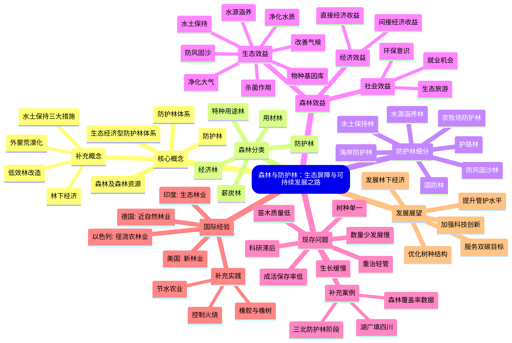

> 在现代生态建设中，森林及其资源管理占据着核心地位。森林不仅为人类提供木材、食物和能源，更是维持生态平衡、应对气候变化的关键组成部分。本文将系统介绍森林及相关概念，探讨防护林体系的建设意义，分析当前存在的问题，并展望国内外的研究与实践进展。

---

#### 一、相关核心概念

**1. 森林及森林资源**  
森林是指覆盖一定面积的树木、植物、动物和微生物共同组成的生态系统。森林资源包括林木、林地以及其所依托的自然资源，具有生态、经济和社会多重价值。它是陆地生物多样性的重要载体，也是全球碳循环的核心环节。

**2. 防护林**  
防护林是以防护为主要目的森林类型，通过人工种植或自然恢复形成，用于防风固沙、水土保持、水源涵养等。根据功能不同，可分为水土保持林、水源涵养林、防风固沙林等。

**3. 防护林体系**  
防护林体系是指在一定区域内，根据自然和社会经济条件，由多种防护林类型有机结合形成的系统性工程。其目标是通过林分结构的优化，实现生态防护功能的最大化。

**4. 生态经济型防护林体系**  
这一体系强调在发挥生态防护功能的同时，兼顾经济效益，例如通过林下经济、生态旅游等实现可持续发展。例如，在一些地区推广的林药、林菌复合模式，既巩固了水土，又提高了居民收入。

**补充内容：**

- **林下经济**：指在森林覆盖下开展的经济活动，如种植药材、食用菌、养殖蜜蜂等。这种方式不仅提高了土地利用率，还为当地农民提供了额外收入来源。
    
- **低效林改造**：针对生长不良、功能低下的林分，通过更替树种、补植补造、抚育管理等措施，提升其生态和经济效能。
    
- **水土保持三大措施**：包括生物措施（如植树种草）、工程措施（如梯田、谷坊）和耕作措施（如等高耕作）。三者结合，综合治理水土流失。
    
- **外蒙的荒漠化历程及其危害**：外蒙古由于过度放牧、气候变化及人为破坏，草原退化严重，荒漠化面积不断扩大，导致沙尘暴频发，不仅影响本地生态环境，还波及中国北方地区，成为跨国环境问题。
    

---

#### 二、森林的分类

根据主导功能的不同，森林可分为以下五类：

- **防护林**：以防护为主要目的，如水土保持林、防风固沙林。
    
- **用材林**：以生产木材、竹材为主要目标。
    
- **经济林**：以生产果品、油料、饮料等林产品为主。
    
- **薪炭林**：专门提供薪柴和木炭原料的林地。
    
- **特种用途林**：用于国防、科研、环保等特殊用途，如国防林、实验林。
    

---

#### 三、防护林的细分类型

防护林根据具体功能可进一步划分为：

- **水土保持林**：减少土壤侵蚀，涵养水源。
    
- **水源涵养林**：位于江河源头，调节径流，净化水质。
    
- **防风固沙林**：防止风沙危害，固定流沙。
    
- **农牧场防护林**：保护农田和牧场，改善小气候。
    
- **海岸防护林**：抵御海风、海浪侵蚀，保护沿海生态系统。
    
- **护路林**：种植于道路两侧，减少噪音、净化空气。
    
- **国防林**：用于军事隐蔽和国防安全。
    

---

#### 四、森林的多元效益

森林的效益可分为生态、经济和社会三个方面：

- **生态效益**：
    
    - 水源涵养：林冠截留雨水，枯落物层增强土壤蓄水能力。
        
    - 防风固沙：降低风速，固定沙丘，防止土地沙化。
        
    - 水土保持：根系固土，减少水土流失。
        
    - 改善气候：调节气温、湿度，缓解城市热岛效应。
        
    - 净化水质：过滤污染物，改善水体质量。
        
    - 净化大气：吸收二氧化碳、释放氧气，吸附粉尘。
        
    - 重要物种基因库：为野生动植物提供栖息地。
        
    - 杀菌作用：某些树种释放的挥发性物质可抑制空气中细菌繁殖。
        
- **经济效益**：
    
    - 直接经济效益：木材、林产品、药材等。
        
    - 间接经济效益：通过生态服务实现，如水资源供给、气候调节。
        
- **社会效益**：  
    提供就业机会，促进生态旅游，增强居民环保意识。
    

**补充内容：**

- **哈尼梯田**：云南哈尼梯田是森林-梯田-村庄-水系四位一体的生态系统，展示了森林在水源涵养与农业可持续发展中的关键作用。
    
- **双碳目标**：即“碳达峰”与“碳中和”。森林作为碳汇，在吸收二氧化碳、减缓气候变化中扮演重要角色。
    
- **六老汉治沙**：甘肃六位老人几十年如一日植树治沙，成功将荒漠变为绿洲，成为中国生态治理的典范。
    
- **森林的杀菌作用**：研究表明，松树、桉树等释放的芬多精具有杀菌、舒缓神经的功效，森林浴因此成为一种健康生活方式。

| 生态效益  |      植物       |
| :---: | :-----------: |
| 抗二氧化硫 | 夹竹桃、女贞、海桐、杜鹃等 |
|  抗烟   |    杨、刺槐、柳等    |
|  抗氟   |   丁香、女贞、松等    |
|  杀菌   |   柏木、柳杉、法桐等   |

---

#### 五、水土保持林学存在的问题

尽管防护林建设取得了一定成效，但仍面临以下问题：

1. **数量少、发展速度缓慢**：防护林覆盖面积不足，且扩种速度跟不上生态退化速度。
    
2. **成活率低、保存率低**：由于自然条件恶劣及管护不足，造林后苗木成活率不高。
    
3. **树种单一、可替换树种研究少**：过度依赖少数树种，导致生态系统稳定性差。
    
4. **生长缓慢、小老林面积大**：土壤贫瘠地区林木生长不良，形成“小老树”林分。
    
5. **现有林分缺乏管理、重治轻管**：重视初期造林，忽视后期抚育管理。
    
6. **科学研究跟不上生产要求**：理论与实践脱节，技术创新不足。
    
7. **造林所用苗木质量低**：苗木品种退化，适应性差。
    

**补充内容：**

- **湖广填四川**：明清时期大规模移民开垦，导致四川盆地森林锐减，水土流失加剧，是历史上人类活动破坏生态的典型案例。
    
- **三北防护林的八个阶段**：从1978年启动至今，三北工程经历了试点、全面推广、巩固提升等阶段，是中国最大的生态工程。
    
- **中国的森林覆盖率与重庆的森林覆盖率**：目前中国森林覆盖率约24%，重庆作为山地城市，森林覆盖率已超过50%，成为长江上游重要生态屏障。
    

---

#### 六、国外水土保持林学研究现状

不同国家根据自身自然条件，发展了各具特色的森林经营模式：

- **美国**：提出“新林业”理念，强调生态优先、多功能经营，注重生物多样性保护。
    
- **德国**：推行“近自然林业”，模仿自然演替过程，优化林分结构，提升生态系统稳定性。
    
- **印度**：发展“生态林业”，将林业与农业结合，推动社区参与式管理。
    
- **以色列**：创新“径流农林业”，在干旱地区收集径流，配套节水技术，实现植被恢复与农业共生。
    

**补充内容：**

- **控制演替进程：有控制的火烧**：美国通过计划火烧促进森林更新，控制病虫害，减少可燃物积累，降低 wildfire 风险。
    
- **橡胶树与橡树**：东南亚广泛种植橡胶树虽带来经济收益，但导致土壤退化；而欧洲注重橡树等乡土树种，兼顾生态与长期经济性。
    
- **节水农业（以色列）**：以色列通过滴灌、污水再利用等技术，最大程度利用水资源，在荒漠中成功发展农业，为干旱区植被恢复提供借鉴。
    

---
#### MindMap总结：森林与防护林

森林与防护林体系建设是应对全球生态挑战的重要手段。当前，我国在水土保持林学领域仍面临诸多问题，需要加强科技创新与管理实践，借鉴国际经验，推动生态经济协同发展。未来，通过优化树种结构、提升管护水平、发展林下经济，防护林必将更好地发挥其生态屏障功能，为实现可持续发展与双碳目标贡献力量。