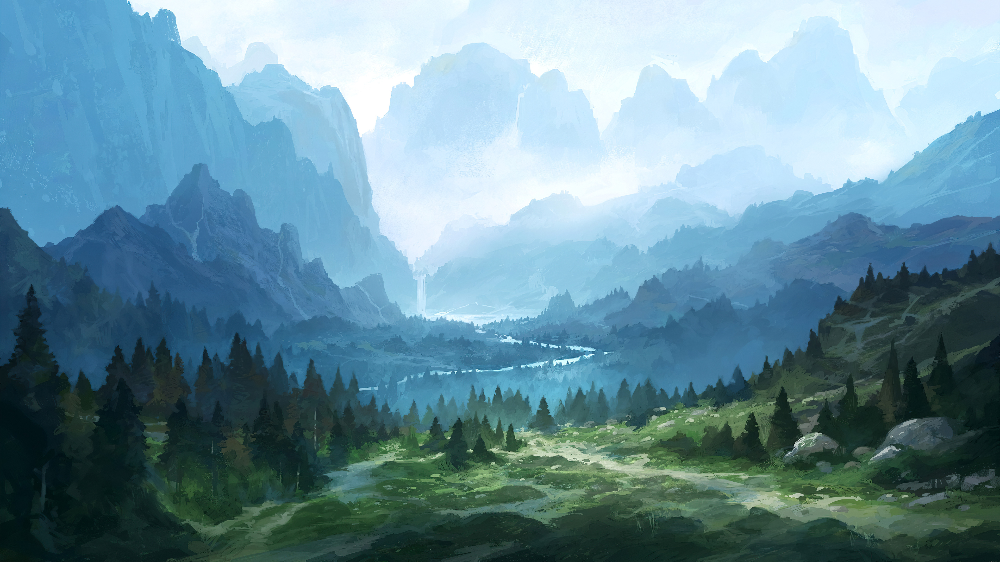
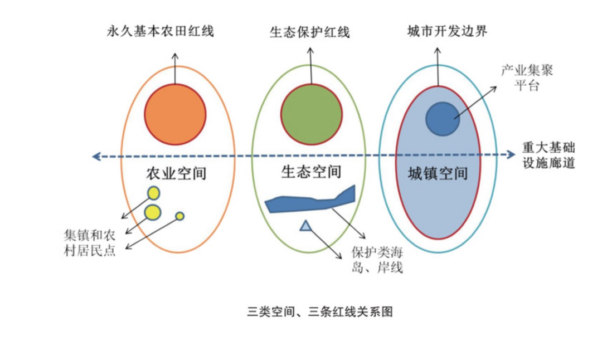
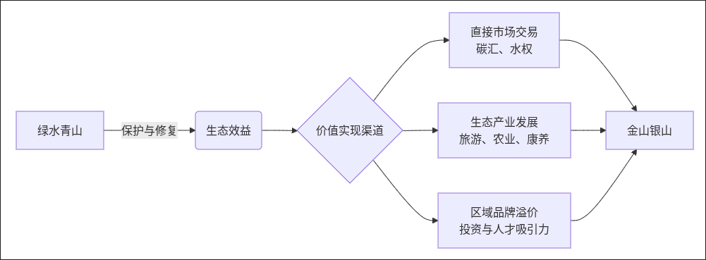

# 从水土保持到生态文明：解读中国绿色发展的科学与理念

> 当我们谈论蓝天白云、青山绿水时，背后是一整套严谨的科学体系和深刻的治国理念。今天，让我们一起探寻水土保持学如何成为生态文明的基石，并解读习近平新时代中国特色社会主义思想中的绿色密码。

## 一、 根基：水土保持学与规划学——山水间的“医生”与“规划师”

如果把受损的生态系统看作一位病人，那么**水土保持学**就是研究病因、病理的基础科学家，而**水土保持规划学**则是制定治疗方案和康复计划的临床医生与规划师。

### **水土保持学：探寻“病因”与“药方”**

它的主要研究内容聚焦两大核心：

1. **水土流失规律（诊断病因）**：深入研究水、风等力量是如何带走土壤的？不同类型的土地（坡地、沟壑、沙地）的“病因”有何不同？自然因素和人类活动如何共同影响这一过程？这相当于医生通过检查和分析，搞清楚疾病的发生机制。
    
2. **水土保持技术措施（开发药方）**：基于上述规律，研发“治疗”和“预防”的技术。例如：
    
    - **工程措施**：像“做手术”，如修建梯田、堤坝、拦沙坝等。
        
    - **生物措施**：像“调养身体”，如植树、种草、恢复植被，利用根系固土。
        
    - **耕作措施**：像“改变生活习惯”，如推广等高耕作、覆盖耕作等保护性农业技术。
        

### **水土保持规划学：制定“康复计划”**

规划学则更进一步，思考如何系统、高效地应用这些“药方”：

1. **土地利用规划**：宏观布局，划定哪里是“生态保护区”不能动，哪里是“农业生产区”需要优化，哪里是“建设开发区”可以适当利用。这是最顶层的设计。

2. **水土保持治理措施配置**：将具体的技术措施，在合适的时间、地点进行组合应用，实现效益最大化。
    
3. **科学依据与新技术的应用**：利用卫星遥感、大数据、人工智能等现代技术进行监测和模拟，让规划更加科学、精准、高效。
    

**总而言之，这两门学问的目标就是：认识自然、尊重规律、科学干预，最终实现人与自然的长久和谐。这正是生态文明建设的底层科学逻辑。**

## 二、 目标：生态文明建设的核心三问

建设生态文明，并非一句口号，它需要回答三个根本性问题。

### **1. 为什么建？——历史的教训与未来的选择**

过去“先污染、后治理”的西方现代化老路，我们走不通，也走不起。资源紧缺、环境污染、生态退化已成为发展的现实瓶颈。同时，人民对美好生活的向往，已经从“盼温饱”变为“盼环保”，从“求生存”变为“求生态”。优美的环境已成为最普惠的民生福祉。建设生态文明，是关乎民族永续发展和人民幸福的必然选择。

### **2. 建成什么样？——人与自然和谐共生的现代化**

我们追求的生态文明，不是回到原始社会，而是要建设一种**人与自然和谐共生的现代化**。它应该是：

- **空间格局优化**：生产、生活、生态空间布局合理。
    
- **环境质量优良**：天蓝、地绿、水清成为常态。
    
- **发展方式绿色**：绿色、循环、低碳成为经济主流。
    
- **生态文化繁荣**：热爱自然、保护环境成为全民自觉。
    

### **3. 怎么建？——系统的路径与坚实的行动**

- **转变发展方式**：推动经济结构绿色转型，发展节能环保产业。
    
- **攻克环境问题**：持续打好蓝天、碧水、净土保卫战。
    
- **修复生态系统**：实施重大生态修复工程，为山河疗伤。
    
- **完善制度体系**：建立最严格的生态环境保护制度，用制度守护绿色。
    

## 三、 指引：习近平新时代中国特色社会主义思想的绿色篇章

在具体实践中，我们以**习近平生态文明思想**为根本遵循，其核心要义尤为突出地体现在以下三点：

### **1. 坚持人与自然和谐共生**

这重新定义了人与自然的关系。我们不再是自然的征服者，而是其中的一部分。保护自然就是保护我们自身，破坏自然就是自毁家园。这一理念要求我们将生态考量融入所有发展规划和政策制定中，实现发展与保护的有机统一。

### **2. 坚持绿水青山就是金山银山（“两山论”）**

这是最生动、最深刻的辩证法。它打破了发展与保护对立的旧思维，指出**保护环境就是发展生产力**。绿水青山本身就有不可估量的经济价值。如何实现价值转化？主要有以下路径：

- **发展生态产业**：好风景带来好“钱景”，生态旅游、绿色农业、康养产业蓬勃发展。
    
- **参与碳汇交易**：植树造林形成的碳汇可以直接在市场上出售，森林就是“绿色银行”。
    
- **提升区域价值**：优良的环境能吸引高端人才和投资，形成强大的品牌效应。
    

### **3. 坚持山水林田湖草沙是生命共同体**

这体现了宏大的**系统思维**。生态是一个环环相扣的有机整体，不能“头痛医头、脚痛医脚”。例如，治理一条河流，不能只盯着河道，还要统筹考虑岸上的森林、农田、湖泊以及整个流域。

最典型的实践就是**“生态清洁小流域”治理**：

- **系统治理**：将**生态修复**（恢复植被）、**生态治理**（工程与生物措施结合）、**生态保护**（源头防控）融为一体。
    
- **综合治理**：不仅治理水土流失，还同步解决农村污水、垃圾问题，改善村容村貌，最终实现“山青、水净、村美、民富”的综合目标。这正是“生命共同体”理念在微观层面的完美体现。
    

---

**结语：**

从微观的水土保持技术，到宏观的生态文明战略，中国正在走一条前所未有的绿色发展之路。这是一条基于科学、源于理念、成于实践的道路，它不仅关乎中国的未来，也为全球可持续发展贡献着独特的东方智慧。守护好我们共同的绿水青山，就是守护世世代代的金山银山。
