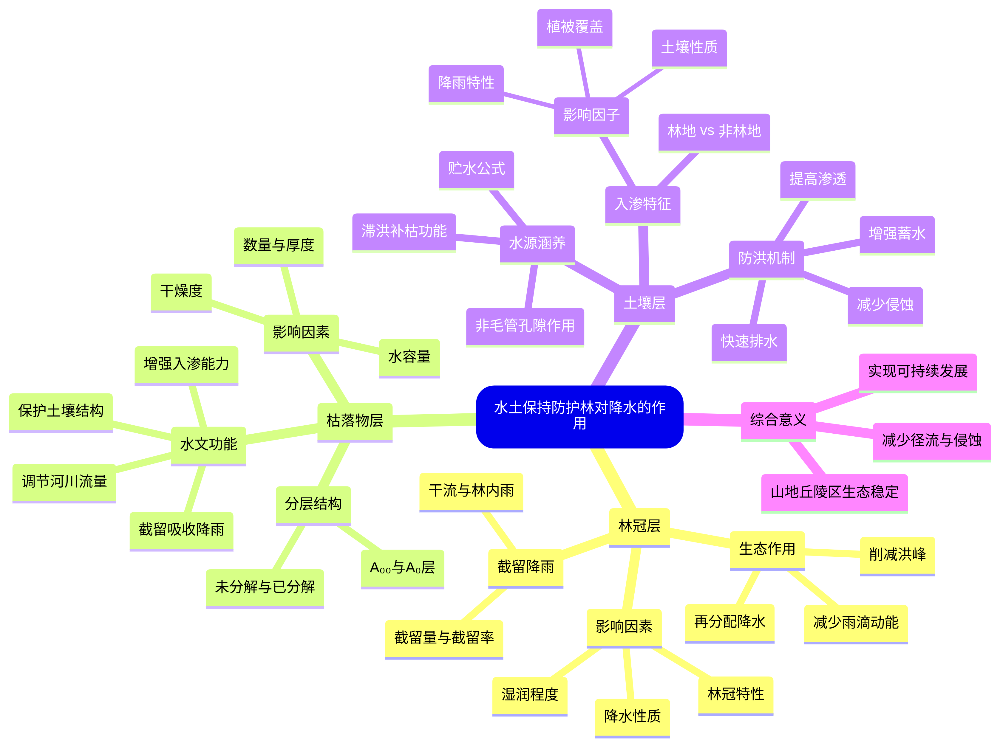

> 水土保持防护林是陆地生态系统中最重要的水文调节器之一。它通过林冠、枯落物层和土壤层的协同作用，实现对降水的再分配、储存和净化，从而在防洪减灾、水源涵养方面发挥不可替代的作用。本文将深入解析防护林对降水的作用机制，揭示森林背后的水文生态智慧。

#### 一、林冠层：降水的第一道拦截网

**相关概念**  
1. **林冠截留**：林木树冠拦截并暂时贮存降雨的现象。
2. **林冠截留量**：单位面积林冠截留的降雨量，通常以毫米计。  
3. **截留率**：截留量占总降雨量的比例。细雨截留率高于暴雨。  
4. **干流量**：沿树干流入地面的雨水。  
5. **林内降雨量**：透过林冠到达地面的降雨，包括“林冠通过雨”和“林冠滴下雨”。

**影响林冠截留的因素**  
1. **林冠特性**：  
   - 树种差异：针叶树（如松树）＞灌木＞软阔叶树（如杨树）＞硬阔叶树（如橡树）。  
   - 林冠结构：重叠多、空隙少的林冠截留能力更强。  
   - 枝叶量：枝叶茂盛则截留量多。  
   - 湿润程度：干燥林冠截留能力优于湿润林冠。  
   > **林冠贮水量C**：表征林冠最大持水能力的指标。

2. **降水特性**：降雨强度、历时和雨滴大小影响截留效果。  
3. **雨前林冠湿润度**：干燥林冠截留能力更强。

**林冠截留的生态作用**  
1. 直接减少地表径流量，推迟产流时间，削减洪峰。  
2. 对降雨进行再分配，形成穿透雨、干流和蒸发三路径。  
3. 改变雨滴动能，减轻对土壤的溅蚀。  
4. 延长降雨历时，增加土壤入渗时间。  
5. 通过穿透雨和树干流将养分从树冠输送至土壤，促进养分循环。

#### 二、枯枝落叶层：地表的天然海绵

**概念**  
枯枝落叶层是林地地表由凋落物形成的覆盖层，按其分解程度分为：  
- **三分法**：未分解层、半分解层、完全分解层。  
- **二分法**：A₀₀层（残体结构可见）、A₀层（残体完全分解）。

**生态功能**  
1. 截留并吸收降雨，减少地表径流。  
2. 彻底消除降雨动能，保护土壤结构。  
3. 增强土壤入渗能力，促进水分下渗。  
4. 增加地表粗糙度，滞缓并分散径流，调节河川流量。  
5. 过滤泥沙，减少河流淤积。

**影响枯落物截留的因素**  
1. **水容量**：单位重量枯落物的最大持水量。  
2. **数量与厚度**：  
   - 输入量：阔叶林＞针叶林，密林＞疏林，成熟林＞幼龄林。  
   - 分解速度：高温湿润环境＞低温干燥环境。  
   - 厚度≥1cm时才能有效发挥水文功能。  
3. **干燥度**：干燥枯落物持水能力更强。

#### 三、土壤层：水分的储存与调节器

##### 1. 水源涵养功能  
森林土壤通过非毛管孔隙储存降水，其贮水能力计算公式：  
```
每公顷降水储存量(t) = 10000 m² × 土层厚度(m) × 非毛管孔隙度(%) × 水容重(1 t/m³)
```  
非毛管孔隙度越大，贮水能力越强。

**森林的水源涵养作用**体现为“滞洪补枯”：  
- 降低洪峰流量，延缓产流时间。  
- 增加旱季径流，缓解水资源短缺。  
> **侧型堰**：用于观测径流的设备，可量化森林的调洪能力。

##### 2. 林地的入渗特征  
**影响入渗的因子**：  
- 土壤含水量：干燥土壤入渗率高。  
- 土壤物理性质：团粒结构、高孔隙度、疏松质地的林地土壤入渗能力强。  
- 降雨特性：低强度长历时降雨有利于入渗。 deepseek_mermaid_20250903_817b02 
- 植被覆盖：植被减少地表结皮，促进入渗。

**一般规律**：林地入渗率显著高于非林地，初始入渗率和稳定入渗率均更高。

##### 3. 水土保持林的防洪机制  
1. 增强土壤蓄水能力，留住更多水分。  
2. 提高土壤渗透性，增加大孔隙数量。  
3. 减少土壤侵蚀，降低泥沙淤积导致的洪水风险。  
4. 在暴雨间隔期快速排空土壤贮水，为下一次降雨腾出空间。

#### 四、山地丘陵区营造水土保持林的意义

在山地丘陵区，水土保持林通过地上部分（冠层、枯落物）和地下部分（根系）的综合作用，有效减少地表径流、控制土壤侵蚀、加固斜坡稳定性。它是实现“绿水青山就是金山银山”理念的关键技术措施。

---

### MindMap总结：水土保持防护林对降水的作用机制


通过以上分析，我们可以看到，水土保持防护林是一个高效的水文调节系统，其多层次结构协同作用，实现了对降水的有效管理。保护和扩大森林覆盖，不仅是生态建设的需要，更是应对气候变化、保障水安全的重要战略。