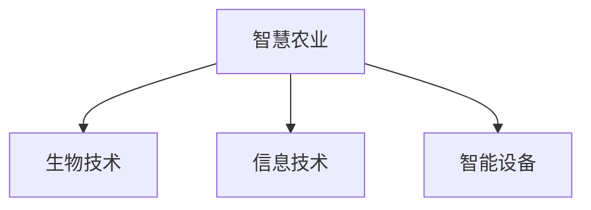

农业的特点及AI应用
- 经验性：AI科学决策
- 复杂性：AI多因素协同
- 不可控：AI智能应对与控制
- 高强度：AI机器代替人力

---

传统农业、现代农业、智慧农业

---

《新一代人工智能发展规划》的涉农内容

---

发展农业AI，促进农业的三个转变
1. 电脑替代人脑
2. 机器替代人工
3. 自主技术替代进口

---

农业版本
- 农业1.0：传统农业
- 农业2.0：机械化农业
	- 第一次绿色革命
- 农业3.0：生物-化学农业
	- 第二次绿色革命
	- 数字农业
- 农业4.0：智慧农业

> 中国正处于3.0（集约化）向4.0（智慧化）阶段过渡

---

智慧农业的概念

---

智慧农业融入了现代农业的三大生产要素

- 生物技术`BT`（品种、农业基础）
- 信息技术`IT`（机器赋能+人增智慧）
- 智能设备`IE`（强化工具手段）

---

智慧农业的发展战略

---

我国智慧农业的推动发展
- 政府推动
- 科技创新
- 企业实践