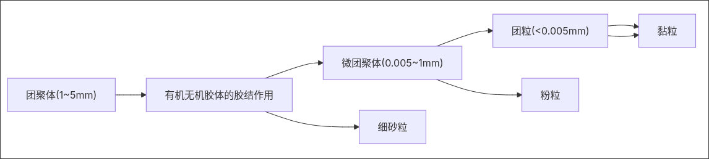

## 一、土壤微生物对土壤可蚀性的影响

**基本定义**：土壤微生物（如细菌、真菌、放线菌）通过其生命活动（如分泌有机物质、菌丝缠绕），能够将细小的土壤颗粒粘结形成稳定的团聚体，从而显著改善土壤结构，增强其抵抗水蚀和风蚀的能力。

**案例**：

- **真菌的作用**：森林土壤中常见的**菌根真菌**，其菌丝体像一张巨大的网，将土壤颗粒包裹捆绑在一起，形成非常稳定的团聚体。这就是为什么林地土壤即使坡度很陡，也不容易发生侵蚀。
    
- **豆科植物的根瘤菌**：豆科植物（如大豆、苜蓿）与根瘤菌共生，能将空气中的氮气固定为氮肥，不仅丰富了土壤养分，其丰富的根系和根瘤残留物也为微生物提供了“食物”，促进了有机质的积累和团粒结构的形成。
    

## 二、土壤结构性

### 1. 团聚体 (Aggregate)

**基本定义**：土壤颗粒（沙、粉、黏粒）通过有机质、菌丝、根系和胶体等胶结物质相互粘结在一起形成的土团。**水稳性团聚体**是指遇水后不易散开的团聚体，是评价土壤抗蚀性的黄金指标。

**案例**：

- **对比案例**：
    
    - **肥沃的菜园土**：抓一把湿润的土壤，可以看到很多细小、疏松的颗粒状结构（即团聚体），松手后土团不会散开，说明结构好，透水保肥。
        
    - **贫瘠的沙化土或板结的黏土**：沙土没有结构，一盘散沙；板结黏土则是一大块，几乎没有孔隙。两者在降雨时都极易被侵蚀。
        

土壤团聚体的结构组成

### 2. 土壤结壳 (Soil Crusting)

**基本定义**：降雨时，雨滴的冲击力破坏土壤表层结构，细小的颗粒（主要是粉粒）分散并随水填入土壤孔隙中，在表面干燥后形成一层薄、硬、致密的硬壳。

**案例**：

- **春季的北方农田**：播种后若遇降雨，土壤表面常常会形成一层硬壳。这层硬壳会严重阻碍幼苗出土（俗称“卡脖子”），同时极大地降低雨水入渗，导致径流产生，带走宝贵的表土和种子。
    

---

## 三、土壤质地 (Soil Texture)

**基本定义**：指土壤中不同大小矿物颗粒（沙粒、粉粒、黏粒）的相对比例。它是一项非常稳定的土壤物理性质，难以通过耕作改变，决定了土壤的许多基本特性。

**案例**：

- **沙土**：感觉粗糙，透水性好但保水性差，像筛子一样。**易发生风蚀**（如我国西北地区的沙漠和沙地）。
    
- **黏土**：感觉光滑粘重，保水保肥能力强但透水性差，容易积水形成地表径流。**易发生水蚀**（如南方红壤地区，降雨后易形成泥浆径流）。
    
- **壤土**：沙黏比例适中，兼有透水和保水的优点，是**最理想、最不易侵蚀**的农业土壤质地。
    

---

## 四、土壤分散率 (Dispersion Ratio) 与侵蚀率 (Erosion Ratio)

**基本定义**：

- **分散率**：衡量土壤在水中分散程度的指标。分散率越高，说明土壤颗粒之间的粘结力越弱，越容易在水中散开并被径流带走。
    
- **侵蚀率**：一个综合了分散率和土壤胶体特性的指标，能更直接地反映土壤遭受侵蚀的潜在风险。
    

**案例**：

- **我国南方红壤**：由于其富含铁铝氧化物，这些氧化物像“胶水”一样将颗粒粘在一起，因此**分散率低，侵蚀率也低**，相对稳定。
    
- **西北黄土**：其主要由粉粒组成，有机质含量低，胶结物质少，因此**分散率非常高**，遇水极易分散成泥浆，导致**侵蚀率极高**。这是黄土高原沟壑纵横、水土流失严重的内在原因。
    

---

## 五、土壤孔隙度 (Soil Porosity)

**基本定义**：单位体积土壤内孔隙体积所占的百分比。它决定了土壤容纳水、空气和根系的能力。

**案例**：

- **耕作的影响**：
    
    - **传统翻耕**：长期机械翻耕会破坏土壤结构，压实土壤，导致孔隙度（尤其是大孔隙）减少，形成**犁底层**，阻碍下渗，诱发径流。
        
    - **保护性耕作**（如免耕、覆盖耕作）：作物残留物覆盖地表，蚯蚓和微生物活动旺盛，能形成丰富的生物孔隙和稳定的团聚体，**孔隙度高**，像一个“海绵体”，能吸收更多雨水，减少侵蚀。
        

---

## 六、关键水文学概念

### 1. 土壤入渗 (Infiltration)

**基本定义**：水分从地表进入土壤的过程。入渗速率是影响地表径流和土壤侵蚀的关键因素。

**案例**：

- **草坪 vs 水泥地**：暴雨时，雨水能迅速渗入**草坪**的土壤中，地表几乎无径流。而**水泥地**入渗率为零，雨水全部形成径流，汇集后冲刷力极强。
    

### 2. 超渗产流 vs 饱和产流 (Infiltration-excess Runoff vs Saturation-excess Runoff)

**基本定义**：

- **超渗产流**：降雨强度 **大于** 土壤入渗能力，多余的水无法下渗而形成地表径流。这在结构差的干旱、半干旱地区土壤中非常常见。
    
- **饱和产流**：土壤本身入渗能力不差，但长期降雨导致整个土壤剖面（尤其是地下水位浅的地区）水分**饱和**，后续降雨无法再下渗而形成径流。这在湿润地区更常见。
    

**案例**：

- **超渗产流**：一场突如其来的暴雨落在久旱的、结壳的农田上，雨水来不及下渗，迅速形成混浊的径流，造成冲刷。
    
- **饱和产流**：南方雨季时，连续阴雨天使山坡土壤完全喝饱了水，即使后续雨不大，也会形成清澈的径流，从土壤表层流走。